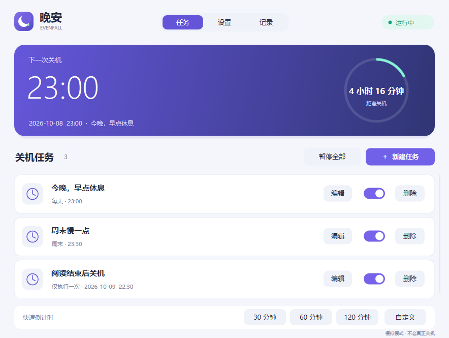

# 晚安 · 定时关机（Evenfall 1.0.0）

一款离线运行的 Windows 10/11 64 位定时关机工具。蓝紫主色、浅深色主题、托盘常驻，以及可以取消或推迟的右下角提醒。

上图为模拟任务示例，首次运行没有预置任务。

## 使用

直接运行发布目录的 **Evenfall.exe**，无需安装。首次运行没有任务，默认关闭登录启动和强制关机。

1. 点击「新建任务」，选择执行一次、按星期重复，或倒计时。
2. 设置日期／24 小时时间；重复任务可任意选择周一至周日。
3. 保存后首页显示下一次关机。关闭主窗口会留在托盘继续执行。
4. 关机前 60 秒提醒。「取消本次」跳过这次，「推迟」可选 10／30／60 分钟。
5. 托盘右键「退出」才会停止软件。

「设置」提供登录后启动、提示音、强制关机、主题、提醒预览和数据目录入口。开启登录启动前，建议把 EXE 放在固定目录；移动程序后重新关闭并开启该选项。Windows 的启动应用设置也能单独禁用启动项。

## 调度规则

- 多个任务同一目标时间时合并提醒；取消／推迟作用于这组任务的本次触发。不同时间的提醒独立计时，同时出现时可以「切换」查看，取消一组不会延后另一组。
- 改名保留已经取消的状态。改变时间／星期会重新安排该任务；保存倒计时任务会从现在重新计时。
- 取消一次任务后结束；重复任务继续等待下一个选中日期。结果保存后，重启软件不会恢复本次任务。
- 睡眠、软件未运行或暂停导致错过时间时，跳过这次，不补关机，也不主动唤醒电脑。
- 启动／恢复时距离目标不足 60 秒，会给出完整 60 秒提醒，本次时间顺延。
- 暂停会关闭当前提醒；恢复只处理未来任务，仍未到期的任务重新提醒。锁屏不暂停调度，锁屏时无法操作桌面提醒。
- 普通关机可能被未保存文档的应用阻止；强制模式可能丢失未保存内容。
- 「已请求关机」表示 Windows 接受请求，最终结果由系统决定。请求登记后进程中断的记录显示「结果待确认」，不会自动重试。

## 数据

当前用户的数据在 **%LOCALAPPDATA%\Evenfall**。保存采用临时文件、刷新和原子替换，保留上一份备份。配置损坏时恢复备份并暂停任务，另保留损坏文件；写入失败也会暂停自动执行。「设置 → 重试保存」成功后仍保持暂停，检查任务后手动恢复。

任务、设置和最近 100 条记录保存在本机。程序没有联网更新、账号、遥测或后台服务。

## 构建

源码使用 C++20、Win32、Direct2D、DirectWrite 和 nlohmann/json 3.12.0。CMake 支持 MSVC 静态运行库，也支持便携 MinGW 静态构建。

### 便携工具链

开发机需要 Python 3。在项目目录执行：

~~~powershell
python scripts/bootstrap.py
powershell -ExecutionPolicy Bypass -File scripts/build.ps1
~~~

工具链为固定版本 w64devkit 2.10.0，下载到项目的 .tools，不会注册或安装到系统。JSON 头文件随源码提供。可用 build.ps1 的 -Python 参数指定 Python 完整路径。

### MSVC

安装 Visual Studio 2022 Build Tools 的 C++ 工具、Windows SDK 和 CMake，然后：

~~~powershell
cmake -S . -B build-msvc -G "Visual Studio 17 2022" -A x64
cmake --build build-msvc --config Release
ctest --test-dir build-msvc -C Release --output-on-failure
python scripts/release.py --build-dir build-msvc/Release --msvc
~~~

发布包在 dist，调试符号独立保存。发布脚本强制检查 EXE 不超过 5,000,000 字节。

## 验证与开发模式

~~~powershell
build\Evenfall.exe --simulate
build\Evenfall.exe --smoke-test "build\ui-smoke"
python scripts/qa.py --build-dir build --exe dist/Evenfall.exe
~~~

模拟模式默认使用独立的 Simulation 数据目录，禁止修改 Windows 自启动，不调用系统关机。界面自检强制模拟，并把数据放在指定输出目录内。--data-dir 可显式指定隔离目录；--tray 启动到托盘。

自动测试覆盖重复计划、跨午夜、合并、取消／推迟、改名、重启、恢复、调时、夏令时、输入校验、损坏恢复、写入失败和提交前保存。实际关机、Windows 11 真机和多个物理显示器的验证步骤见 [测试说明](docs/TESTING.md)。本地发布未做代码签名。

## 文件结构

- src/core.*：独立调度引擎，可注入日历及时间快照。
- src/platform.*：Windows 时区、存储、自启动、权限和关机执行器。
- src/ui.hpp、src/app.cpp：绘图、主题、窗口、键盘、托盘和提醒。
- tests：调度及 Windows 持久化测试。
- scripts：工具准备、构建、打包及资源占用验证。
- third_party：固定 JSON 头文件与第三方许可证。

JSON 使用 MIT 许可；便携构建所含 GCC 运行库适用 GCC Runtime Library Exception，相关文本随便携包提供。

## 许可证

本项目采用 [MIT License](LICENSE)，第三方组件许可见 [THIRD-PARTY-NOTICES.txt](THIRD-PARTY-NOTICES.txt)。
